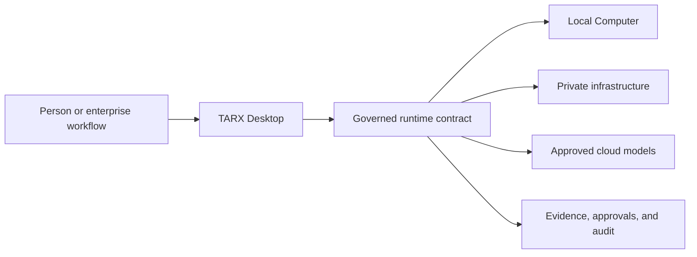

# John Wantz Jr.

### AI Systems Architect · Applied AI Platform Lead · Founder of [TARX](https://tarx.com)

I design and ship controlled AI systems across local devices, customer-managed
infrastructure, cloud services, and enterprise workflows. My work connects
agent architecture, model orchestration, retrieval, privacy, evaluation,
governance, product definition, and human-centered interaction.

[TARX](https://tarx.com) ·
[Download](https://tarx.com/download) ·
[Documentation](https://docs.tarx.com) ·
[Portfolio](https://www.johnwantz.com/portfolio) ·
[LinkedIn](https://www.linkedin.com/in/johntwantz/)

## Building TARX

TARX is a local-first AI runtime for work: **Computer by default,
Supercomputer by permission.**

It provides the operating layer around models and agents: persistent context,
private memory, approved capabilities, tool execution, policy, human approval,
model routing, and evidence.

The public Apple Silicon beta includes signed and notarized releases,
installation verification, a local runtime bridge, security documentation, and
system-integrity checks.

- [TARX Desktop](https://github.com/tarx-ai/tarx-desktop) — public Mac beta,
  releases, security boundaries, and QA
- [TARX CLI](https://github.com/tarx-ai/tarx-cli) — local runtime installation,
  health, model context, and operator commands
- [TARX organization](https://github.com/tarx-ai) — product, runtime, and public
  technical work

## Current focus

- Governed agents, permissions, approvals, and evidence-backed actions
- Local and private AI deployment
- Enterprise search, RAG, retrieval, and source grounding
- Model routing, memory, persistent context, and tool use
- Evaluation systems, acceptance criteria, QA, and release validation
- AI product and experience patterns for complex, regulated workflows
- Architecture-first implementation with AI-native engineering workflows

## Enterprise systems experience

My work spans AI and digital systems at LexisNexis, State Farm, Charles Schwab,
Target, AT&T, and venture-backed startups. I have translated legal research,
insurance support, financial advice, marketplace, identity, voice, and
enterprise-search workflows into product architecture, system requirements,
governance controls, and launch paths.

## Selected technical proof

- [TARX Desktop public releases](https://github.com/tarx-ai/tarx-desktop/releases)
- [TARX system integrity](https://github.com/tarx-ai/tarx-desktop/blob/main/docs/SYSTEM_INTEGRITY.md)
- [TARX security policy](https://github.com/tarx-ai/tarx-desktop/blob/main/SECURITY.md)
- [Attribute-based Commerce Checkout](https://patents.google.com/patent/US20150278931A1/en)
- [Multi-Device Session Identity](https://patents.google.com/patent/US20160119469/en)

## Work with me

I am interested in senior roles, advisory work, and focused engagements
involving:

- AI systems architecture and applied AI platforms
- Enterprise AI implementation and transformation
- Forward-deployed AI product work
- Agent governance, evaluation, and operational controls
- Enterprise search and knowledge systems
- AI product strategy, design, and conversational experiences

For roles, partnerships, or investment conversations:
[wantzjt@gmail.com](mailto:wantzjt@gmail.com).
